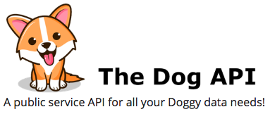
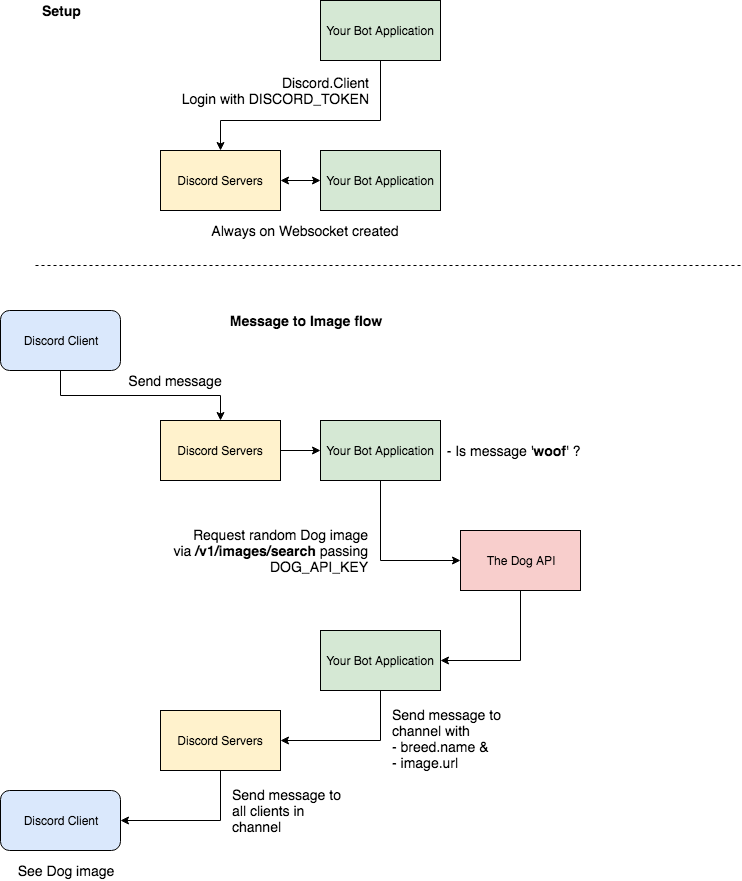

# theDogAPI-discord-bot
Example of how to make a Discord bot using theDogAPI.com

# How it looks in the Discord Client

# Setup
- Get your [API Key](https://thedogapi.com/signup) (it'll be emailed to you immediately)
- Setup a [Discord App](https://discordapp.com/developers/applications/me/create) & create a Bot user - save the TOKEN it gives you
- Clone this repo and add change 'DOG_API_KEY' and 'DISCORD_TOKEN' for the values you from above.
- run 'npm install' in the cloned folder to install the libraries
- run 'node index.js' to start the application
- In the Discord channel you added the Bot send the message 'woof'
- Enjoy the Dog image!

# How does it work?

